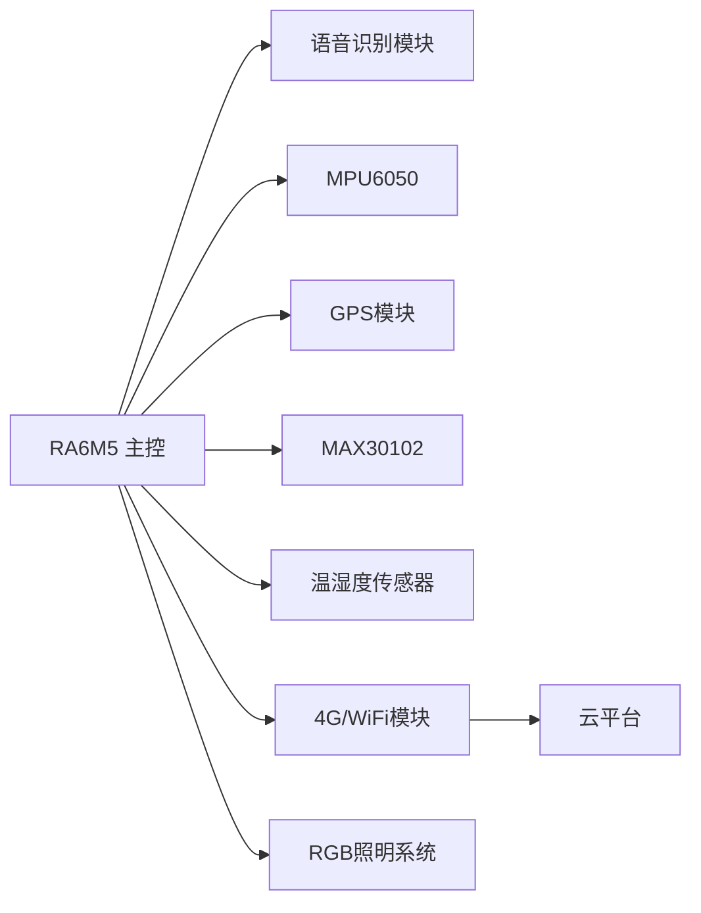

# Smart-Cycling-Helmet
### 🤖 Assistant


# 🚴‍♂️ 智能骑行头盔 - SmartRide Helmet

[](https://www.renesas.com/us/en/products/microcontrollers-microprocessors/ra-cortex-m-mcus)
[](https://opensource.org/licenses/MIT)
[]()

**SmartRide Helmet** 是一款基于瑞萨RA6M5微控制器的智能骑行头盔系统，集成了多种传感器模块和云端通信功能，提供全面的骑行安全保障和数据监测服务。项目采用模块化设计，便于扩展和维护。

  
*(头盔概念图 - 可添加实际照片)*

## 🌟 核心功能

### 🛡️ 安全保障

- **摔倒检测系统**：MPU6050六轴传感器实时监测骑行姿态，检测到摔倒后自动发送位置信息
- **紧急呼救功能**：语音触发或自动触发紧急通知机制
- **环境灯光预警**：智能灯光系统根据环境光线调整亮度，夜间自动开启警示灯

### 💓 健康监测

- **心率血氧实时监测**：MAX30102传感器持续追踪用户生理指标
- **疲劳状态提醒**：心率异常时通过灯光和震动提醒用户休息
- **环境适应提示**：温湿度监控提供舒适度建议

### 🗣️ 智能交互

- **语音控制系统**：支持语音指令控制灯光、求助等功能
- **GPS轨迹记录**：记录并上传骑行路线数据
- **OTA远程升级**：支持固件远程更新

### ☁️ 云平台集成

- 实时上传传感器数据至云端服务器
- 历史数据可视化分析
- 紧急事件自动通知预设联系人
- API接口开放供二次开发

## 🔧 硬件组成

| 模块          | 型号              | 接口 | 功能                          |
| ------------- | ----------------- | ---- | ----------------------------- |
| **主控制器**  | Renesas RA6M5     | -    | ARM Cortex-M4内核，200MHz主频 |
| **语音识别**  | LD3320 / SYN7318  | UART | 语音指令识别与处理            |
| **IMU传感器** | MPU6050           | I2C  | 3轴加速度计+3轴陀螺仪         |
| **GPS定位**   | Neo-6M / SIM808   | UART | 实时位置追踪                  |
| **健康监测**  | MAX30102          | I2C  | 心率+血氧检测                 |
| **环境监测**  | DHT11+BMP280      | I2C  | 温湿度+气压检测               |
| **无线通信**  | ESP8266 / SIM800L | UART | WiFi/4G云端连接               |
| **灯光系统**  | WS2812B RGB LEDs  | GPIO | 可编程照明与警示              |
| **电源管理**  | 18650电池组       | -    | 锂电池供电系统                |

**系统连接示意图**：



## 📂 软件架构

```
SmartRide-Helmet/
├── firmware/           # RA6M5主程序
│   ├── src/            # 源代码
│   │   ├── core/       # 核心系统
│   │   ├── drivers/    # 外设驱动
│   │   ├── modules/    # 功能模块
│   │   ├── cloud/      # 云端通信
│   │   └── utilities/  # 工具函数
│   └── ra_gen/         # Renesas配置生成文件
├── hardware/           # 电子设计文件
│   ├── schematics/     # 原理图
│   └── pcb/            # PCB布局文件
├── docs/               # 文档资料
│   ├── wiring/         # 接线指南
│   ├── datasheets/     # 器件数据手册
│   └── images/         # 示意图和照片
├── cloud_examples/     # 云端应用示例
│   ├── python/         # Python服务端
│   └── arduino_cloud/  # Arduino Cloud配置
└── mobile_app/         # 配套安卓应用(可选)
```

## ⚙️ 安装与使用

### 硬件准备

1. RA6M5开发板或自定义PCB
2. 各传感器模块（见硬件组成）
3. 18650电池组 (7.4V 2000mAh+)
4. 3D打印头盔外壳（设计文件在 `hardware/enclosure` 目录）

### 软件环境

- [e² studio](https://www.renesas.com/us/en/software-tool/e-studio) 2023+
- Renesas Flexible Software Package (FSP) 4.5.0
- Git (版本控制)

### 快速开始

1. 克隆仓库：

```bash
git clone https://github.com/YourUsername/SmartRide-Helmet.git
```

2. 导入e² studio：

- 打开e² studio
- 选择 File > Import > General > Existing Projects into Workspace
- 选择克隆的 `firmware` 目录

3. 配置云端服务：

```c
// cloud_config.h
#define CLOUD_API_KEY "your_api_key_here"
#define SERVER_URL "mqtt.your-server.com"
#define PORT 1883
```

4. 编译并烧录到RA6M5开发板

5. 按以下顺序连接模块：

```
RA6M5 TX -> Wi-Fi/4G模块 RX
RA6M5 RX -> Wi-Fi/4G模块 TX
RA6M5 SCL -> I2C传感器时钟线
RA6M5 SDA -> I2C传感器数据线
```

## ☁️ 云端配置

项目支持多种云平台接入：

- [ThingSpeak](https://thingspeak.com/)（免费）
- AWS IoT Core（高可靠）
- 腾讯云IoT Explorer
  The Things Stack（LoRaWAN）

配置示例（ThingSpeak）：

```c
const char* server = "api.thingspeak.com";
const char* apiKey = "YOUR_API_KEY";
const int field_temperature = 1;
const int field_heartrate = 2;
```

## 🌱 扩展与自定义

- **添加新传感器**：在`modules/sensors`创建新驱动
- **修改警报逻辑**：调整`modules/safety/fall_detection.c`
- **扩展云功能**：修改`cloud/cloud_service.c`
- **灯光模式定制**：编辑`modules/lighting/light_patterns.h`

## 📄 许可证

本项目采用 **MIT许可证** - 查看 [LICENSE](LICENSE) 文件了解更多详情。

## 🤝 参与贡献

欢迎贡献代码、改进报告和新想法！

1. Fork 项目仓库
2. 创建新分支 (`git checkout -b feature/new-feature`)
3. 提交更改 (`git commit -am 'Add new feature'`)
4. 推送到分支 (`git push origin feature/new-feature`)
5. 创建 Pull Request

## 📞 联系与支持

- **电子邮件**: your.email@example.com
- **Issues**: [提出问题](https://github.com/YourUsername/SmartRide-Helmet/issues)
- **讨论区**: [社区讨论](https://github.com/YourUsername/SmartRide-Helmet/discussions)

## 🌟 特别鸣谢

- 所有参与的开发者
- Renesas提供的开发套件和支持
- [Adafruit](https://www.adafruit.com/)提供的开源源码
- 开源社区的相关项目

**温馨提示**：本项目的安全功能不应替代传统骑行安全措施，请正常佩戴头盔并遵守交通规则。

---

> **项目状态**：  
> 🟢 稳定版 - v1.2.0 (2024年10月)  
> 📊 当前功能完成度：95%  
> ✅ 测试覆盖率：86%  
> 🔜 计划功能：蓝牙低功耗连接、太阳能充电、手势控制


