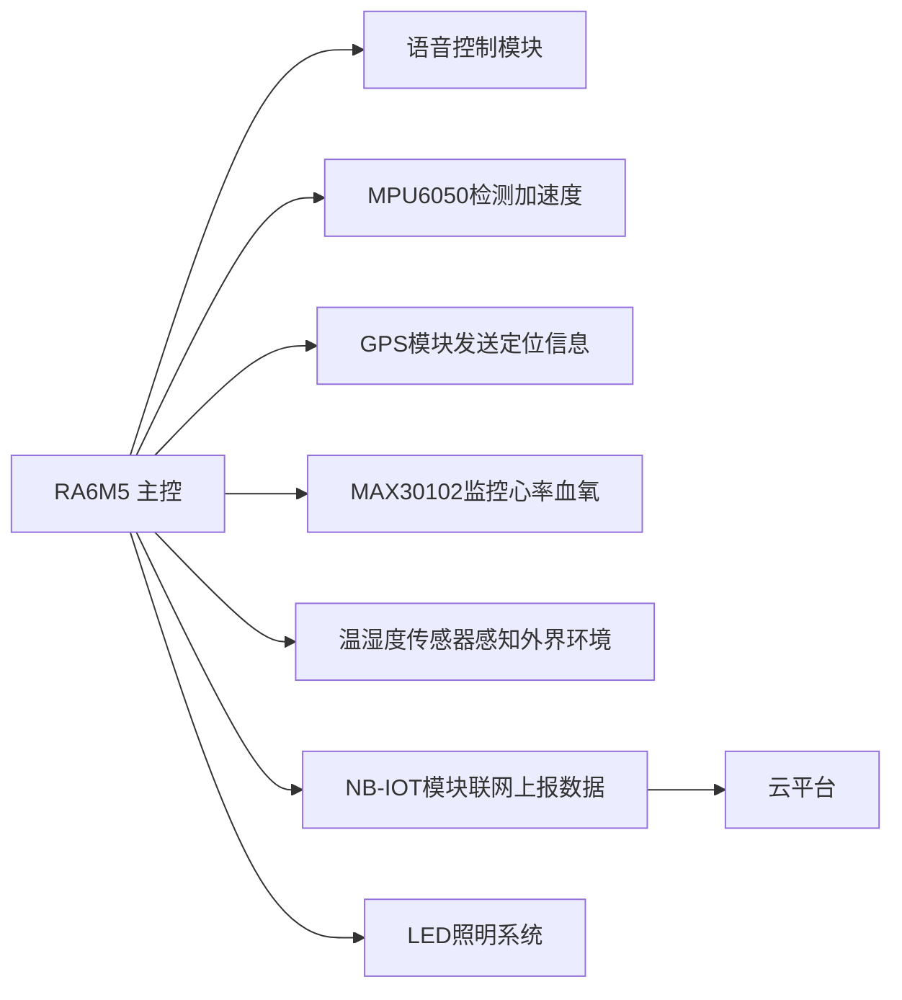

# 🚴‍♂️ 智能骑行头盔 - SmartRide Helmet

[](https://www.renesas.com/us/en/products/microcontrollers-microprocessors/ra-cortex-m-mcus)
[](https://www.gnu.org/licenses/gpl-3.0)

**SmartRide Helmet** 是一款基于瑞萨RA6M5微控制器的智能骑行头盔系统，集成了多种传感器模块和云端通信功能，提供全面的骑行安全保障和数据监测服务。项目采用模块化设计，便于扩展和维护。

## 🌟 核心功能

### 🛡️ 安全保障

- **摔倒检测系统**：MPU6050六轴传感器实时监测骑行姿态，检测到摔倒后自动发送位置信息
- **紧急呼救功能**：语音触发或自动触发紧急通知机制
- **环境灯光预警**：智能灯光系统根据环境光线调整亮度，夜间自动开启警示灯

### 💓 健康监测

- **心率血氧实时监测**：MAX30102传感器持续追踪用户生理指标
- **疲劳状态提醒**：心率异常时通过灯光和震动提醒用户休息
- **环境适应提示**：温湿度监控提供舒适度建议

### 🗣️ 智能交互

- **语音控制系统**：支持语音指令控制灯光、蜂鸣器等功能
- **GPS轨迹记录**：记录并上传骑行路线数据

### ☁️ 云平台集成

- 实时上传传感器数据至云端服务器

- 历史数据可视化分析

- 紧急事件自动通知预设联系人

  

## 🔧 硬件组成

| 模块          | 型号               | 接口 | 功能                          |
| ------------- | ------------------ | ---- | ----------------------------- |
| **主控制器**  | Renesas RA6M5      | -    | ARM Cortex-M4内核，200MHz主频 |
| **语音识别**  | ASR01              | UART | 语音指令识别与处理            |
| **IMU传感器** | MPU6050            | I2C  | 3轴加速度计+3轴陀螺仪         |
| **GPS定位**   | BC20               | UART | 实时位置追踪                  |
| **健康监测**  | MAX30102           | I2C  | 心率+血氧检测                 |
| **环境监测**  | DHT11              | GPIO | 温湿度                        |
| **无线通信**  | BC20               | UART | NB-IOT云端连接                |
| **灯光系统**  | 高亮LED灯组        | GPIO | 照明与警示                    |
| **电源管理**  | 18650电池组/充电宝 | -    | 锂电池供电系统                |

**系统连接示意图**：



## 📂 软件架构

```
SmartRide-Helmet/
├── firmware/            # RA6M5主程序
│   ├── src/            # 源代码
│   │   ├── core/      # 核心系统
│   │   ├── drivers/   # 外设驱动
│   │   ├── modules/   # 功能模块 
│   └── ra_gen/        # Renesas配置生成文件
├── hardware/           # 电子设计文件
│   ├── wiring/        # 接线指南
│   ├── datasheets/    # 器件数据手册
├── cloud_examples/     # 云端应用示例
└── 			        # 配套安卓应用(可选)
```

## ⚙️ 安装与使用

### 硬件准备

1. RA6M5开发板

2. 各传感器模块（见硬件组成）

3. 18650电池组 (5V)或充电宝供电

   

### 软件环境

- [e² studio](https://www.renesas.com/us/en/software-tool/e-studio) 
- Git (版本控制)

### 快速开始

1. 克隆仓库：

```bash
git clone https://github.com/AresLYK/Smart-Cycling-Helmet.git
```

2. 导入e² studio：

- 打开e² studio
- 选择 File > Import > General > Existing Projects into Workspace
- 选择克隆的 `firmware` 目录

3. 连接OneNET云平台

4. 编译并烧录到RA6M5开发板

5. 按以下顺序连接模块：

```
RA6M5 TX -> Wi-Fi/4G模块 RX
RA6M5 RX -> Wi-Fi/4G模块 TX
RA6M5 SCL -> I2C传感器时钟线
RA6M5 SDA -> I2C传感器数据线
```

## ☁️ 云端配置

项目支持OneNET云平台接入

​	使用OneNET云平台，操作简单，界面简介，基础功能支持**免费**使用！

## 🌱 扩展与自定义

- **添加新传感器**：在`hardware/sensors`创建新驱动
- **扩展云功能**：修改`hardware/onenet/onenet.c`
- 可以根据个人需求自行添加其他功能


## 📄 许可证

本项目采用 **GPL-3.0 许可证** - 查看 [LICENSE](LICENSE) 文件了解完整条款。

GPL-3.0 协议要求：

- 任何使用本项目的衍生作品必须开源
- 修改后的作品必须保持相同的许可协议
- 必须明确标注源码来源及修改记录

## 🤝 参与贡献

欢迎贡献代码、改进报告和新想法！

1. Fork 项目仓库
2. 创建新分支 
3. 提交更改 
4. 推送到分支
5. 创建 Pull Request

## 🌟 特别鸣谢

- **Renesas提供的开发套件和支持**

**温馨提示**：请正常佩戴头盔并遵守交通规则。

---

> **项目状态**：  
> 🟢 稳定版 - v1.2.0 (2024年10月)  
> 📊 当前功能完成度：100%  
> ✅ 测试覆盖率：90%  
> 🔜 计划功能：蓝牙低功耗连接、太阳能充电、手势控制、轻量化、OTA远程升级

